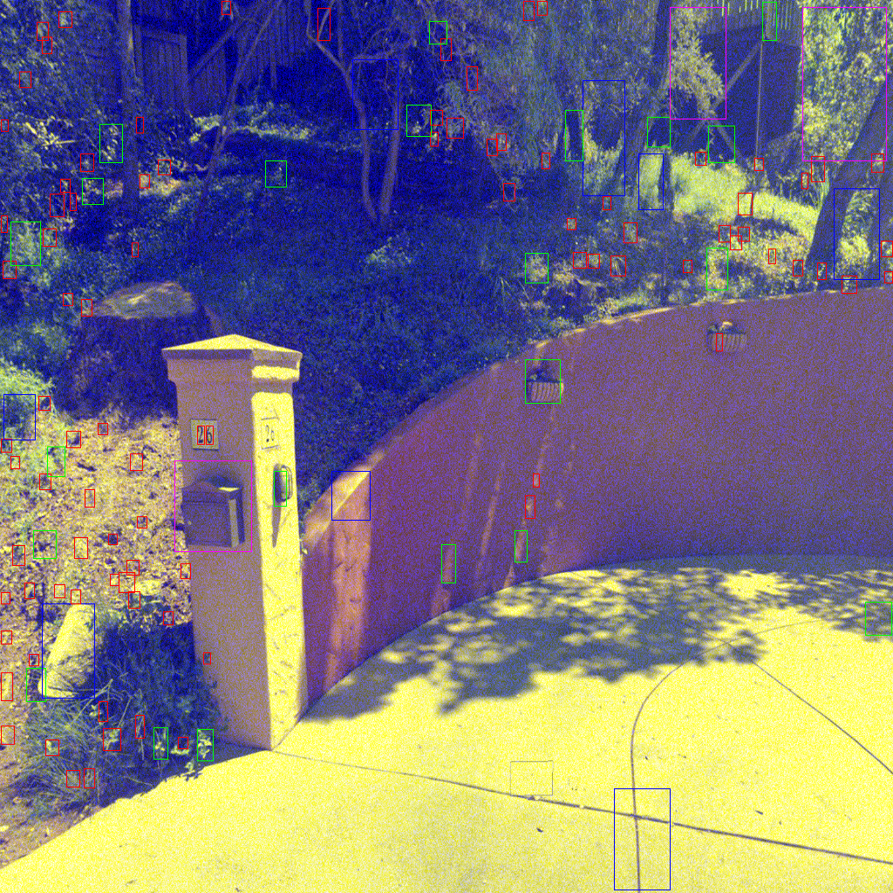
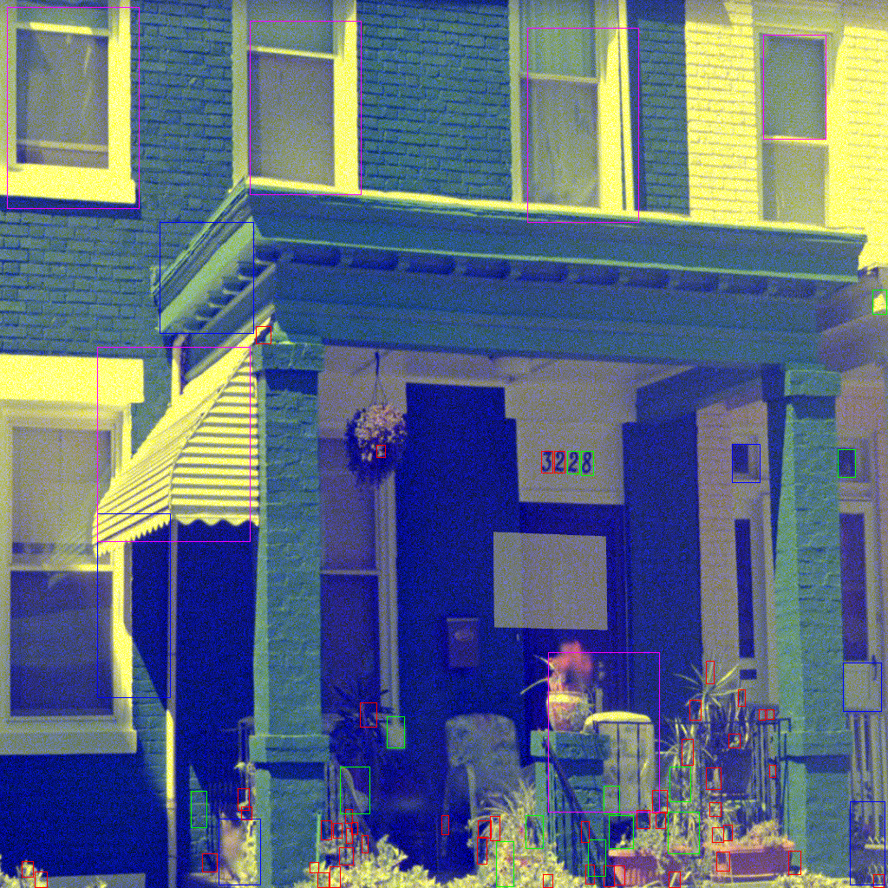
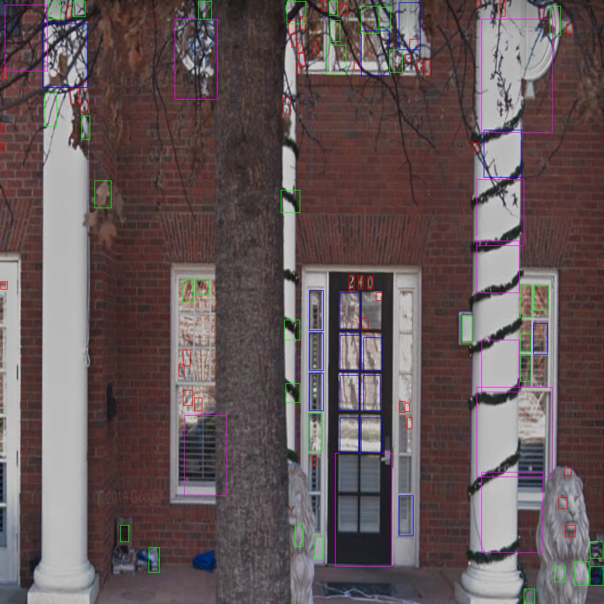
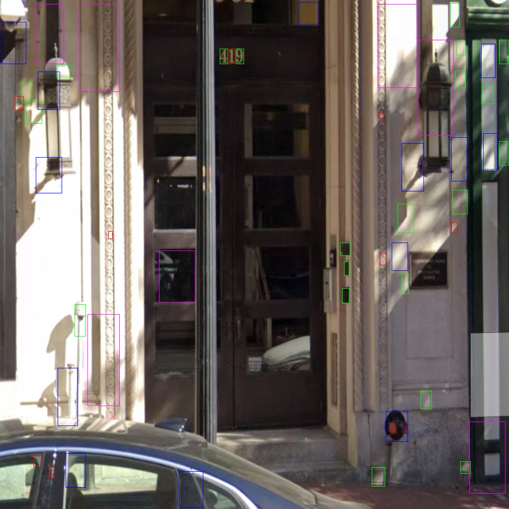

Final project for CS 6476 Computer Vision

## Data Preprocessing
Training uses the SVHN format one dataset. To train model, data must first be preprocessed, to do this, download `train.tar.gz` and `test.tar.gz` files corresponding to the train and test sets, and unzip them in the folders `data/train` and `data/test` respectively. Run `python preprocess.py` in the `cv_proj` conda environment. If you want to train with negative images examples included, you must get a number of images without house numbers in them, and put them in the directories `data/negative_examples/train` and `data/negative_examples/test`. These images will be sliced into lots of small cutouts by `preprocess.py`

## Training
To train model after running `preprocess.py`, run `python -m stage2.train_net` from the top level directory. Specify LR, momentum, batch size, and other hyperparameters in `stage2/config.json`. Training will be slow on a CPU. I could not import pytorch's Tensorboard in the cv_proj class enviroment, so this is commented out in `train_net.py`. Note that pretrained model weights are in the folder `saved_weights`, so training is not necessary.

## Inference
Put images you want to run inference on in the folder `input_images`, this folder currently contains {1-5}.png but more can be added. Inference should run fast (<2sec per image). Run `python run.py` to load saved weights, process each image in `input_images`, print out the detected digits for each image to the console, and write each image, with the MSER ROIs superimposed to the `graded_images` directory. The folder `paper_figures` contains Figures 1 and 2 from my writeup, so that the results shown the paper can be verified. To run inference on these images, run `python run.py --image_directory graded_images`

## Examples of ROIs from MSER preprocessing step
MSER is applied at multiple scales of an image pyramid to help with scale invariance, different color boxes correspond to ROIs obtained at different levels of the pyramid. Red boxes came from the lowest level, purple boxes came from the highest. An ensemble of small CNNs classifies digits (or lack thereof) in each ROI for fast (~1sec) CPU inference. Since training was done on the SVHN dataset (contains mostly close ups), and the pipeline is optimized for these more zoomed out images (for which there is no large labelled dataset, I cant provide accuracy stats, but it seems to work decently well based on the images I tried ¯\_(ツ)_/¯).

